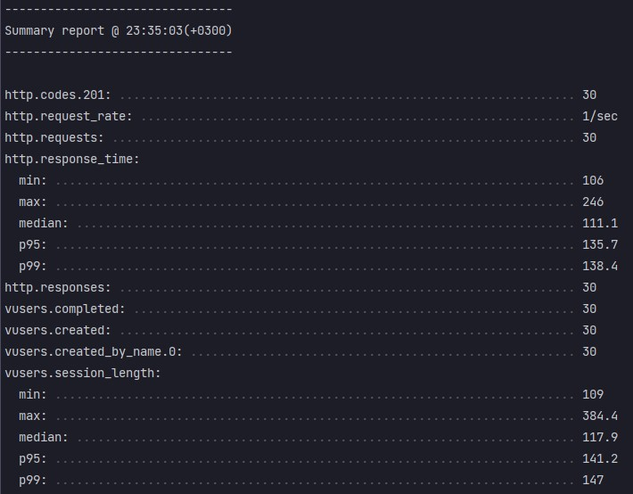

# RS School REST service

## Prerequisites

- Git - [Download & Install Git](https://git-scm.com/downloads).
- Node.js - [Download & Install Node.js](https://nodejs.org/en/download/) and the npm package manager.

## Downloading

```
git clone {repository URL}
```

## Installing NPM modules

```
npm install
```

##  Running application and work with DATABASE
1. Install [Docker](https://docs.docker.com/engine/install/)
2. Go to the root directory of the project
3. Execute the commands sequentially in the terminal
   * `docker-compose up -d`
   * `npm run migration:generate`
   * `npm run migration:run`
   * `npm run start:dev`

## Testing

After application running open new terminal and enter:

To run all tests without authorization

```
npm test
```

To run only one of all test suites (users, boards or tasks)

```
npm test <suite name>
```

To run all test with authorization

```
npm run test:auth
```

To run only specific test suite with authorization (users, boards or tasks)

```
npm run test:auth <suite name>
```

## Development

If you're using VSCode, you can get a better developer experience from integration with [ESLint](https://marketplace.visualstudio.com/items?itemName=dbaeumer.vscode-eslint) and [Prettier](https://marketplace.visualstudio.com/items?itemName=esbenp.prettier-vscode) extensions.

### Auto-fix and format

```
npm run lint
```

### Debugging in VSCode

Press <kbd>F5</kbd> to debug.

For more information, visit: https://code.visualstudio.com/docs/editor/debugging

### Fastify



### Express

